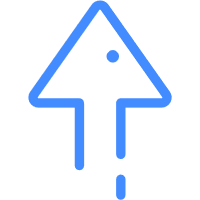

# 简单JS实现滚动监听以及滑动到顶部

用原生js来实现滚动监听以及滑动到顶部，当页面从顶部向下滑动超过300px时，**返回顶部**的图片出现，点击图片后，页面平滑的移动到页面顶部

[原文链接](<https://www.artjay.me/2019/back-top/>)

**HTML代码：**

```html
<div class="uptop" id="uptop">
	
</div>
```

**CSS代码：**

```css
.uptop{
    position:fixed;
    bottom:-50px;
    right:30px;
    width:50px;
    z-index:9999;
    -webkit-transition:all .5s;
    -moz-transition:all .5s;
    -ms-transition:all .5s;
    -o-transition:all .5s;
    transition:all .5s;
}
.uptop img{
    width:80%;
    cursor:pointer;
}
```

**JS代码：**

```javascript
window.onscroll = function(){ 
    var t = document.documentElement.scrollTop || document.body.scrollTop;  //获取距离页面顶部的距离
    var uptop = document.getElementById( "uptop" ); //获取div元素
    if( t >= 300 ) { //当距离顶部超过300px时
        uptop.style.bottom=30+'px';//使div距离底部30px，也就是向上出现
    } else { //如果距离顶部小于300px
        uptop.style.bottom=-50+'px';//使div向下隐藏
    } 
} 

var top=document.getElementById("to-top");//获取图片元素
var timer=null;
top.onclick = function(){ //点击图片时触发点击事件
    timer=setInterval(function(){ //设置一个计时器
        var ct = document.documentElement.scrollTop || document.body.scrollTop; //获取距离顶部的距离
        ct-=30;
        if(ct>0){//如果与顶部的距离大于零
                window.scrollTo(0,ct);//向上移动30px
        }
        else{//如果距离小于等于零
                window.scrollTo(0,0);//移动到顶部
                clearInterval(timer);//清除计时器
        }
    },5);//隔5ms执行一次前面的function，展现一种平滑滑动效果
}
```

只需将这三段代码分别引入到相应的位置即可，**如果更换图片，要注意路径是否正确**